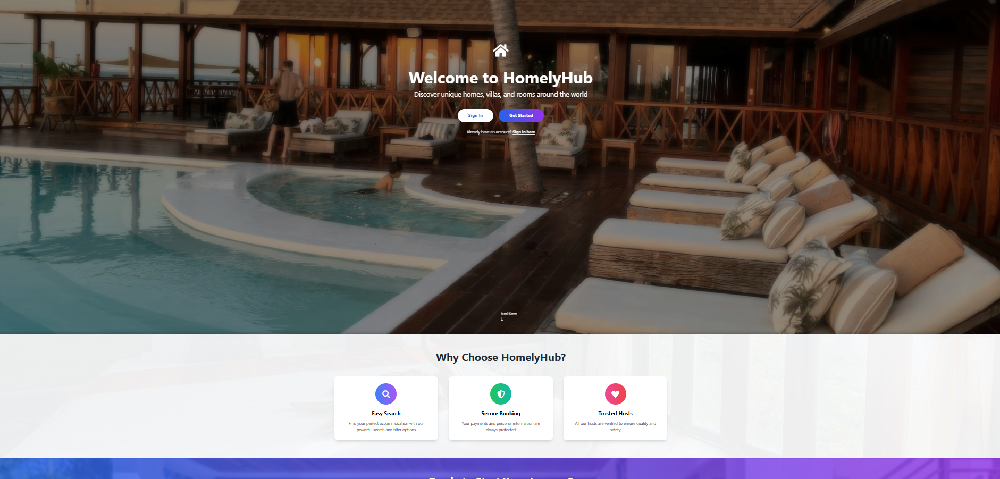
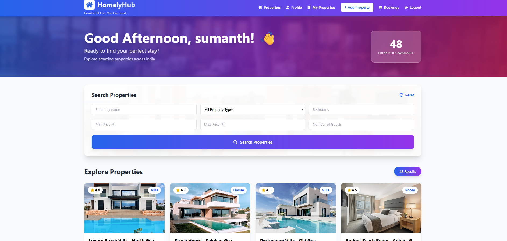
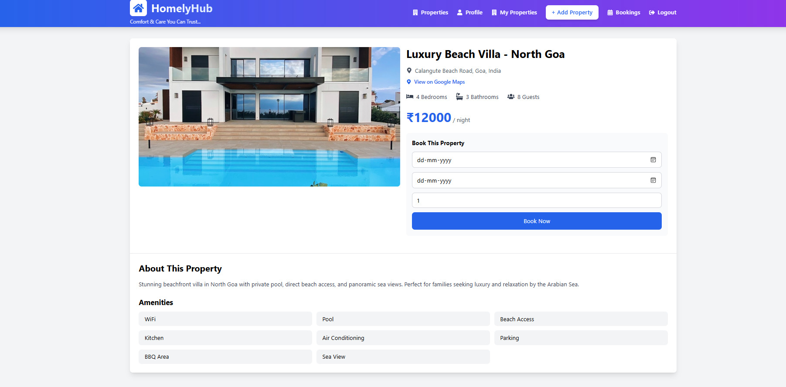

# 🏠 HomelyHub

A simple website where people can find and book places to stay while traveling across India.

## What does this website do?

- **For Travelers:** Search and book homes, villas, apartments, and rooms
- **For Property Owners:** List your property and earn money
- **Easy booking** with dates and guest selection
- **Secure login** for all users

---

## 🛠️ Technologies Used

### Frontend (What users see)
- **React** - Makes the website interactive
- **Tailwind CSS** - Makes it look beautiful
- **React Router** - Helps navigate between pages
- **Axios** - Talks to the server

### Backend (Behind the scenes)
- **Node.js** - Runs JavaScript on the server
- **Express.js** - Handles website requests
- **MongoDB** - Stores all data (users, properties, bookings)
- **JWT** - Keeps user login secure
- **Bcrypt** - Protects passwords

---

## 📸 Screenshots

### Landing Page


### Home Page with Properties


### Property Details


---

## 🚀 How to Run This Project on Your Computer

### Step 1: Things You Need First
1. **Node.js** - Download from [nodejs.org](https://nodejs.org)
2. **MongoDB** - Download from [mongodb.com](https://www.mongodb.com/try/download/community)
3. **VS Code** - Download from [code.visualstudio.com](https://code.visualstudio.com)

### Step 2: Download the Project
```bash
git clone https://github.com/YOUR-USERNAME/homelyhub.git
cd homelyhub
```

### Step 3: Setup Backend (Server)
```bash
cd backend
npm install
```

Create a file called `.env` in the backend folder and add:
```
PORT=5000
MONGO_URI=mongodb://localhost:27017/homelyhub
JWT_SECRET=your_secret_key_here
NODE_ENV=development
```

Add sample properties to database:
```bash
node seedData.js
```

Start the backend server:
```bash
npm run dev
```

You should see: "Server is running on port 5000"

### Step 4: Setup Frontend (Website)
Open a NEW terminal and type:
```bash
cd frontend
npm install
npm start
```

Your browser will open automatically at `http://localhost:3000`

---

## 👤 Test Accounts

### Regular User (For booking properties)
- Email: `user@test.com`
- Password: `password123`

### Host (For listing properties)
- Email: `host@homelyhub.com`
- Password: `password123`

---

## 📁 Project Structure
```
homelyhub/
├── backend/               # Server code
│   ├── config/           # Database connection
│   ├── controllers/      # Business logic
│   ├── models/           # Data structure
│   ├── routes/           # API endpoints
│   ├── middleware/       # Security
│   └── server.js         # Main file
│
├── frontend/             # Website code
│   ├── src/
│   │   ├── components/  # Reusable parts (Navbar, Footer)
│   │   ├── pages/       # Different pages (Home, Login)
│   │   ├── context/     # User login info
│   │   └── utils/       # Helper functions
│   └── public/          # Images and files
│
└── README.md            # This file!
```

---

## ✨ Features

✅ User registration and login  
✅ Search properties by city, type, price  
✅ View property details with photos  
✅ Book properties with dates  
✅ User profile management  
✅ Host can add/delete properties  
✅ View your bookings  
✅ Responsive design (works on phones)  

---

## 🐛 Common Problems and Solutions

### Problem: "Cannot connect to MongoDB"
**Solution:** Make sure MongoDB Compass is open and connected

### Problem: "Port 3000 already in use"
**Solution:** Close other React apps or change the port

### Problem: "Module not found"
**Solution:** Run `npm install` again in that folder

---

## 📚 What I Learned

- How to build a full website from scratch
- How to connect frontend and backend
- How to save data in a database
- How to make websites secure with passwords
- How to make websites look good with CSS

---

## 🎯 Future Improvements

-  Add payment gateway (Razorpay/Stripe)
-  Add reviews and ratings
-  Add photo upload from computer
-  Add email notifications
-  Add admin dashboard
-  Add Google Maps integration

---

## 👨‍💻 Author

**Your Name**
- GitHub: https://github.com/sumanth-nallajonnala
- Email: sumanth.nljna@gmail.com

---

## 📝 License

This project is for learning purposes. Feel free to use it!

---

## 🙏 Acknowledgments

- Thanks to WSA Academy for the project idea
- Thanks to Unsplash for free images
- Thanks to MongoDB, React, and Node.js communities

---

Made with ❤️ by Sumanth Nallajonnala...